# BrickBreaker

## 摘要

近些年由于个人电脑、智能手机的普及，越来越多的人找到了自己喜欢的游戏。游戏特效，游戏情节不断推陈出新，然而自己对自己玩的第一款手机游戏打砖块仍然情有独钟。所以希望自己来对这个游戏做一点小小的创新。使用Qt5做界面，利用动量守恒和能量守恒来更新速度，同时引入“重力加速度”使得游戏更加有趣味。

##### 关键词: 打砖块，Qt5，动量守恒，能量守恒

## 一、  游戏描述

玩家通过移动一个滑块来保证小球不会掉落到地面，小球碰到滑块会反弹。小球碰到砖块会获得相应的分数。当消除完所有的砖块或者小球掉落到地面时，游戏结束。

## 二、  设计与实现

### 1.  流程图

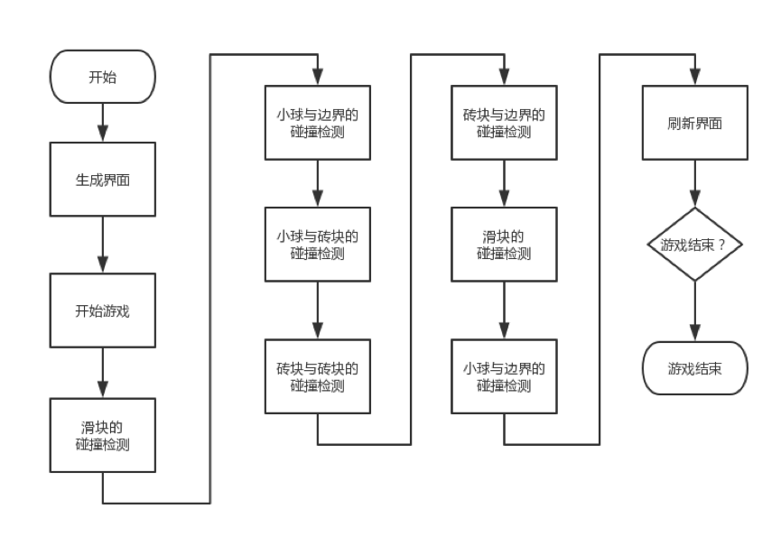

### 2.  数据结构

一共使用了5个类，包括Ball、Bar、Brick、Game、MainWindow，其中MainWindow和图形化界面有关。

``` c++
/*
 * 小球类
 * 包含属性：位置、速度、大小、重力加速度
 * 包含方法：构造函数、析构函数、初始化、设置/获得速度、设置重力加速度、更新
 */
class Ball
{
public:
    Ball(qreal left, qreal top, qreal diameter);
    ~Ball();
    QRectF* getPosition() const;
    qreal getVx() const;
    qreal getVy() const;
    void setVx(qreal vx);
    void setVy(qreal vy);
    void update();
    void initial();
    void setG(qreal g);
private:
    QRectF *position;
    qreal left;
    qreal top;
    qreal diameter;
    qreal vx;
    qreal vy;
    qreal g;
};

/*
 * 滑块类
 * 包含属性：位置、速度、大小
 * 包含方法：构造函数、析构函数、初始化、设置/获得速度、更新
 */
class Bar
{
public:
    Bar(qreal left, qreal top, qreal width, qreal height);
    ~Bar();
    QRectF* getPosition() const;
    qreal getV() const;
    void setV(qreal V);
    void update(qreal leftLimit, qreal rightLimit);
    void initial();
private:
    QRectF *position;
    qreal left;
    qreal top;
    qreal width;
    qreal height;
    qreal v;
};

/*
 * 砖块类
 * 包含属性：位置、颜色、速度、大小、重力加速度、是否有效
 * 包含方法：构造函数、析构函数、初始化、设置/获得速度、设置重力加速度、更新、设置/获得有效
 */
class Brick
{
public:
    Brick(qreal left, qreal top, qreal width, qreal height,  QColor color);
    ~Brick();
    QRectF* getPosition() const;
    qreal getVx() const;
    qreal getVy() const;
    QColor getColor() const;
    bool getLive() const;
    void setVx(qreal Vx);
    void setVy(qreal Vy);
    void update();
    void setG(qreal g);
    void setLive(bool live);
private:
    QRectF *position;
    QColor color;
    qreal vx;
    qreal vy;
    qreal g;
    bool live;
};

/*
 * 游戏类
 * 包含属性：一个小球、小球的图标、一个滑块、滑块的图标、一个砖块列表、文件有效、输、赢、重力加速度、分数
 * 包含方法：构造函数、析构函数、初始化、获得赢的情况、获得输的情况、获得分数、设置重力加速度、画图像
 */
class Game : public QWidget
{
    Q_OBJECT
public:
    explicit Game(int width, int height, QWidget *parent = 0);
    ~Game();
    Ball *ball;
    Bar *bar;
    QList<Brick*> bricks;
    void initial();
    bool getIsWin() const;
    bool getIsFailed() const;
    int getScore() const;
    void setG(qreal g);
protected:
    void paintEvent(QPaintEvent *event);
signals:

public slots:
    void updateGame();
private:
    int row;
    int column;
    int score;
    int width;
    int height;
    bool fileOk;
    bool isWin;
    bool isFailed;
    qreal g;
    QPixmap barPixmap;
    QPixmap ballPixmap;
    QColor randomColor();
};
```

### 3.  算法

a. 更新速度
利用重力加速度来改变竖直方向速度。
$$
v_y = v_y + g
$$

b. 判断碰撞方向
由于在程序中使用QRectF来保存小球、滑块、砖块的位置，所以可以利用一部分Qt自带的函数bool QRectF.intersects(QRectF&)来判断是否发生碰撞。
如果发生了碰撞，接下来就是要判断发生碰撞的方向。
最容易想到的方法是利用坐标区间来判断，但是会有问题。
利用坐标区间判断碰撞的方向只适用于简单的情况

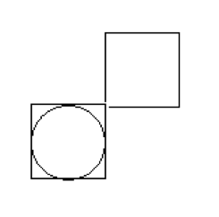

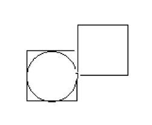

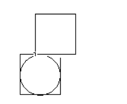

这样的情况可以利用坐标区间很容易判断，只要一个小球（砖块）的[left, right]与另外一个砖块的[left, right]区间有公共部分，就是左右碰撞，否则是上下碰撞。
但是由于本程序中速度大于1，也就是说，位置更新不是连续的，所以会出现这样的情况。

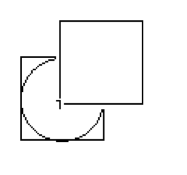

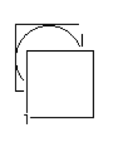

这个时候[left, right]和[top, bottom]（top表示上边界、bottom表示下边界，但是top < bottom）都会有重叠部分，只按照坐标区间来判断，比较困难。
所以本程序采用了其他的方法。
首先计算得到小球（砖块）和砖块的中心坐标，然后拿两个中心坐标构成的三角形与刚好对角碰撞的时候的三角形进行比较。

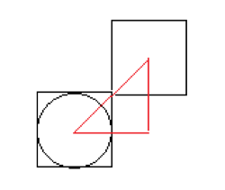

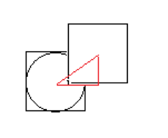

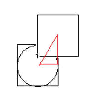

为了叙述方便，将对角碰撞形成的三角形成为标准三角形。
如果三角形水平长度与三角形竖直长度的比值大于标准三角形的比值，说明水平方向分量要长，就认为发生了水平方向的碰撞，否则是竖直方向的碰撞。但是由于三角形竖直长度可能为零，做除法可能出现除数为零的情况，所以将判断的公式改写为
if(qAbs(ballCenterX - brickCenterX) / (ballPosition->width() + brickPosition->width()) >= qAbs(ballCenterY - brickCenterY) / (ballPosition->height() + brickPosition->height()))
和
if(qAbs(brickCenterX - brick1CenterX) / (brickPosition->width() + brick1Position->width()) >= qAbs(brickCenterY - brick1CenterY) / (brickPosition->height() + brick1Position->height()))

c. 计算碰撞之后的速度。
为了体现游戏的真实感，利用了能量守恒和动量守恒。
$$
\frac{1} {2} m_1 v_1^2 + \frac{1} {2} m_2 v_2^2 = \frac{1} {2} m_1 {v'}_1^2 + \frac{1} {2} m_2 {v'}_2^2 \\

m_1 v_1 + m_2 v_2 = m_1 {v'}_1 + m_2 {v'}_2
$$

最后得到
$$
v_1 = \frac {(m_1 - m_2) v_1 + 2m_2v_2} {(m_1 + m_2)} \\
v_2 = \frac {(m_2 - m_1) v_2 + 2m_1v_1} {(m_1 + m_2)}
$$

所以更新的公式也有了，但是做了一点点修改。
当被碰撞的物体静止的时候，设置质量很大，并且只会改变该物体竖直方向速度，即使发生的是水平碰撞。并且静止物体的质量设置很大，所以静止的物体碰撞之后几乎做自由落体。否则会出现横扫千军的情况。

d. 滑块速度
当用户按下左右的快捷键时，滑块会更新水平的速度，这个速度不仅仅控制滑块的移动，还会影响碰到滑块的物体的速度，物体获得滑块速度的，滑块速度变为原来的$\frac {1} {2}$，同时滑块的每一次移动，速度都会变成原来的$\frac{4}{5}$。

e. 撞击到滑块
物体撞到滑块，竖直速度变为最大值。小球的速度最大值保证能够达到顶端，砖块的速度的最大值为小球最大值的 $\frac{1}{\sqrt{2}}$。

f. 其他边界碰撞检测
要进行两次检测，分别是开始和结束，结束的检测保证了不会超过边界，开始的检测保证的最开始速度的合理性。起初只在最开始进行了碰撞检测，后来发生了超越边界的情况。

## 三、  不同版本

#### 版本1：控制台版

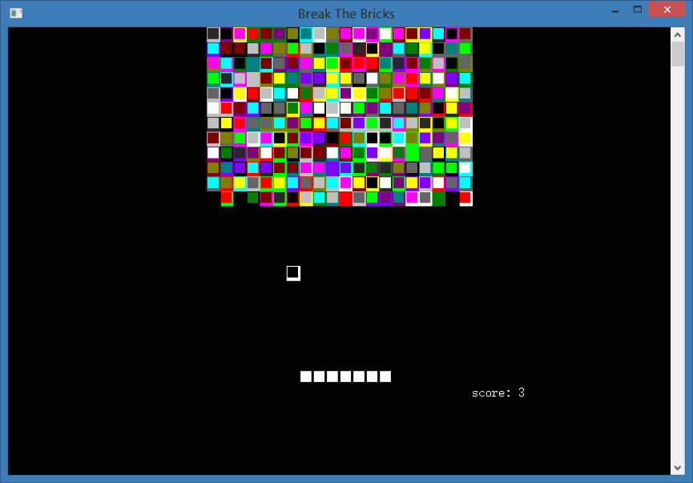

通过移动控制台光标的位置控制输出，而不是刷屏。

使用多线程处理按键更新滑块和小球移动

由于两个线程都要移动控制台的光标，会发生竞争条件，所以需要加锁实现互斥。

#### 版本2：Qt版

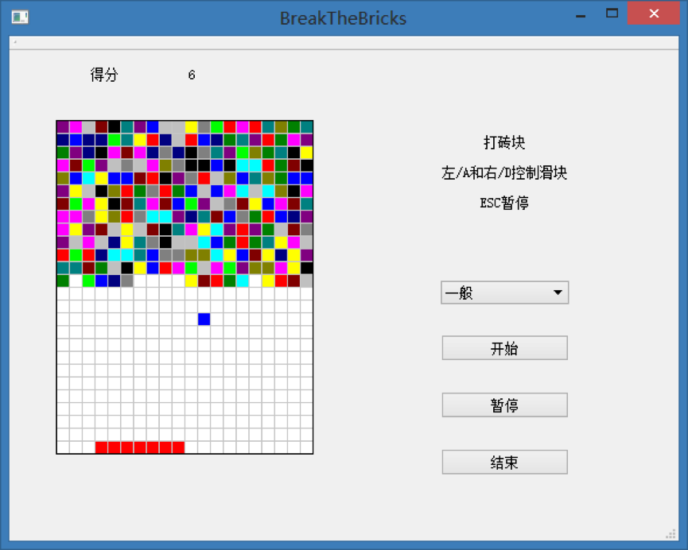

只是将版本1使用Qt来实现，功能上没有扩展。

整个游戏窗口使用二维数组来保存，利用下标就可以更新状态，不存在竞争条件，所以没有加锁互斥。

由于Qt能够自己处理键盘输入事件，所以没有用到多线程。

#### 版本3：最终版

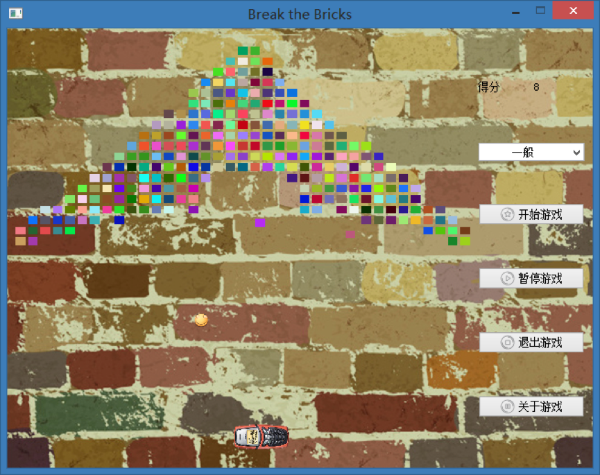

基本上对游戏进行重做。

没有使用固定的格子，而是每一个对象都由自己独立的位置、大小、形状。

利用Qt的QPainter来绘制窗口，按照像素来更新位置。

引入速度、重力加速度的概念。

砖块第一次被碰撞不会消失而是做自由落体，第二次被小球碰到才会消失。

对小球的速度进行限制，降低难度。

合理利用砖块可以超神。


## 四、  使用说明

resources文件夹放置图片素材，用户可以自己更改。

[maps]()文件夹放置地图，程序使用map.txt来生成砖块地图。

使用A和J来控制滑块向左移动

使用D和L来控制滑块向右移动

保证不会小球不会掉落地面，消灭全部砖块！


## 五、  总结与感想

有的时候我们会认为某些游戏不好玩，往往不是对它全部的否定，可能只是因为游戏中的某一点不合自己的胃口。自己可以对游戏进行一些修改增加趣味性啊，或者直接自己写一个比较简单好玩的游戏。打砖块在黑白屏幕手机上很流行，因为硬件的限制，没有很好的体验。现在自己在游戏中加入了新鲜有趣的元素，偶尔拿出来玩一玩也是很有意思的。